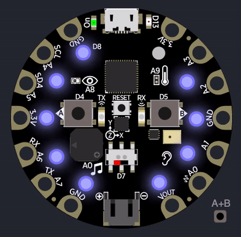

# SmartDistancing Badge

## Hardware
TODO: Add specs and BOM to the repository

## Simulator

Simulation of the SmartDistancing LED badge, using the Adafruit CircuitPlayground simulator on Visual Studio Code.

1. Get Visual Studio Code
2. Download the drivers for Adafruit CircuitPlayground board
3. Download the VS code extension "Device Simulator Express"
4. Run the example scripts using the simulator
